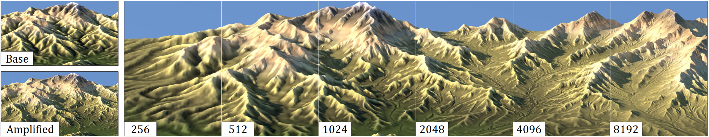

# Multi-scale Erosion source code

This is the release code for the paper *Terrain Amplification using Multi-scale Erosion*, to be published in Transactions on Graphics. Please reference this article when using the source code.



## Compile

Clone the repository using:
```
git clone https://github.com/H-Schott/MultiScaleErosion.git
```

Can be compiled on Windows or Linux, using the CMake file.
Requires at least OpenGl 4.3 for compute shaders.

On Linux, additional packages may be required:
```
libxi-dev libxcursor-dev libxinerama-dev libxrandr-dev
```

## Workflow

Check the boxes in the UI (only one at a time) to apply the corresponding erosion algorithm.
Best results are obtained by the following sequence:
erosion -> thermal -> deposition
Alternating this sequence with the x2 upsampling gives great amplification results.

Presets of sequence of erosion are also available in the app ("Results" buttons)
