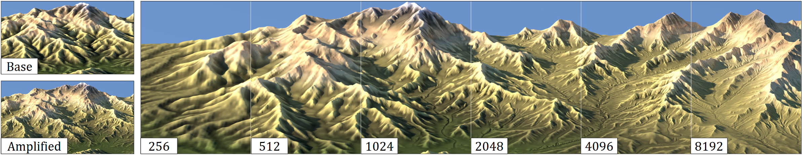

# Upsampling Digital Terrains with Soil Simulation - Source Code

James Ridley

rdljam003@myuct.ac.za

This is the source code for the paper *Upsampling Digital Terrains with Soil Simulation*. 

## Requirements

This code is only tested on Windows. You will need to install CMake and a C++ compiler (Visual Studio recommended). In addition, you need the following libraries installed:

- GLEW
- GLFW
- GLM
- GDAL

## Compilation

Compile the code with:

```
mkdir build
cd build
cmake ..
cmake --build . --config Release
```

## Implementation details

This implementation is based on the Multi-scale Erosion paper (see below). My contributions are:

- The `soil_deposition.glsl` shader implements the soil deposition algorithm described in the paper.
- GeoTIFF loading and storing using GDAL.
- Some utility functions for inspecting different layers.


### _Below is the original readme of this repository_

## Multi-scale Erosion source code

This is the release code for the paper *Terrain Amplification using Multi-scale Erosion*, to be published in Transactions on Graphics. Please reference this article when using the source code.
A small mono-scale example is also available on ShaderToy : https://www.shadertoy.com/view/XX2XWD.
You'll find more links about the project on this page : https://h-schott.github.io/publications/mserosion/publi_mserosion.html.



## Compile

Clone the repository using:
```
git clone https://github.com/H-Schott/MultiScaleErosion.git
```

Can be compiled on Windows or Linux, using the CMake file.
Requires at least OpenGl 4.3 for compute shaders.

On Linux, additional packages may be required:
```
libxi-dev libxcursor-dev libxinerama-dev libxrandr-dev
```

## Workflow

Check the boxes in the UI (only one at a time) to apply the corresponding erosion algorithm.
Best results are obtained by the following sequence:
erosion -> thermal -> deposition

Alternating this sequence with the x2 upsampling gives great amplification results.

Presets of sequence of erosion are also available in the app ("Results" buttons)
